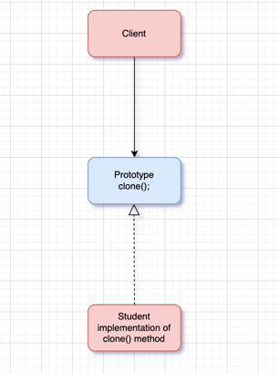

# design-patterns
## Creational Design Patterns
1. **Factory Design Pattern** - The Factory is a creational design pattern that simplifies object creation by using a special class(factory)
to create objects for you, so you(client) don't have to use the `new` keyword directly. This makes it easier to change the
type of object being created without changing the code that uses it.

2. **Abstract Factory Design Pattern** - The Abstract Factory is a creational design pattern provides a way to create groups of related
objects without specifying their concrete classes.

3. **Builder Pattern** - Builder pattern allows you to construct complex objects in  a step-by-step manner. By using builders, directors
, and a well-defined product class you can maintain clean and moduler code, making it easy to create different variants of a product.
   
   **Components of the Builder Pattern** - 

   **Product (Desktop)**: The complex object that is being built.

   **Builder (DesktopBuilder)**: An interface or abstract class that specifies the methods for creating the parts of the Product.

   **Concrete Builders (DellDesktopBuilder, HpDesktopBuilder)**: Classes that implement the Builder interface and provide specific implementations for creating the parts of the Product.

   **Director (DesktopDirector)**: The class responsible for managing the building process. It calls the builder methods in a specific order to create the desired Product.

   **Client (BuilderApplication)**: The class that initiates the building process through the Director.

4. **Prototype Pattern** - The prototype design pattern is a creational design pattern used to create new objects by copying an existing instance. This
pattern is useful when object creation is costly or complex.

5. **Singleton Pattern** - The single design pattern is a creational design pattern that ensures a class has only one instance and provides a global point of access to this instance.

## Behavioral Design Patterns

1. **Strategy Design Pattern** - The Strategy Design Pattern is a behavioral design pattern that enables selecting an algorithm's behavior at runtime. Instead of implementing a single 
algorithm directly, code receives runtime instructions about which of a family of algorithms to use.

How It Works:
 - ***Strategy Interface (PaymentStrategy)*** : This interface defines the common method pay that all concrete strategies must implement.
 - ***Concrete Strategies (CreditCardPayment, PayPalPayment, BankTransferPayment)*** : These classes implement the PaymentStrategy interface, each providing its own algorithm for processing a payment.
 - ***Context (PaymentContext)*** : This class uses a PaymentStrategy to execute the payment. The strategy can be set at runtime, allowing the context to use different algorithms as needed.
 - ***Client (ClientApplication)*** : The client code demonstrates how to use the context and switch between different payment strategies dynamically.

2. **Command Pattern** - Command is a behavioral design pattern that turns a request into a stand-alone object that contains all information about the request. This transformation lets you pass requests 
as a method arguments, delay or queue a request’s execution, and support undoable operations. 

How it works:
  - ***Command Interface*** : Declares methods for executing and undoing operation.
  - ***Concrete Command Classes*** : Implement the Command interface and define specific actions, including undo.
  - ***Receiver*** : Performs the actual work requested by the command.
  - ***Invoker*** : Stores and executes commands, and can undo the last command.
  - ***Client*** : Configures the commands and receivers.

## Structural Design Patterns

1. **Facade Design Pattern** - The Facade design pattern is a structural design pattern that provides a simplified interface to a complex subsystem. It encapsulates the complexity of the subsystem by 
providing a single interface that clients can use, thus making the subsystem easier to use and understand.
2.  **Decorator Design Pattern** - The decorator design pattern is a structural design pattern used to extend or alter the functionality of objects at runtime by wrapping them in a series of decorators.
It provides a flexible alternative to subclassing for extending functionality.